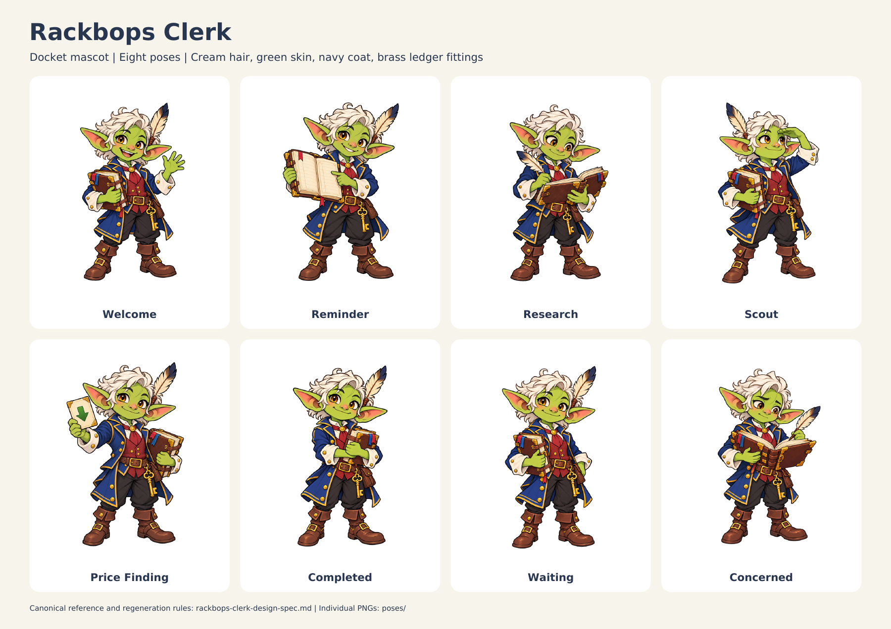

# Rackbops Clerk mascot assets

Rackbops Clerk is the fantasy town-clerk mascot for Docket and its tracker Discord instance. It does not replace Luma, the generic bot host mascot.

## Masters and reference

| File | Use |
|---|---|
| [rackbops-clerk.png](rackbops-clerk.png) | Original approved concept, preserved unchanged; atmospheric surround remains |
| [rackbops-clerk-transparent.png](rackbops-clerk-transparent.png) | Clean full-body transparent mascot |
| [rackbops-clerk-design-spec.md](rackbops-clerk-design-spec.md) | Identity, palette, construction, reproduction and usage rules |
| [rackbops-clerk-avatar-master.png](rackbops-clerk-avatar-master.png) | Generated square portrait reference |
| [rackbops-clerk-favicon-master.png](rackbops-clerk-favicon-master.png) | Separately simplified head mark, transparent |

## Poses

Each pose is an individual full-body transparent PNG. Use the pose sheet to compare expressions and gestures.

| File | Use |
|---|---|
| [poses/welcome.png](poses/welcome.png) | Registration and onboarding |
| [poses/reminder.png](poses/reminder.png) | Due tasks and reminders |
| [poses/research.png](poses/research.png) | Research progress and findings |
| [poses/scout.png](poses/scout.png) | Interests and want-list updates |
| [poses/price-finding.png](poses/price-finding.png) | Price-drop finding, without a purchase implication |
| [poses/completed.png](poses/completed.png) | Completed tasks and history |
| [poses/waiting.png](poses/waiting.png) | Pending work and quiet empty states |
| [poses/concerned.png](poses/concerned.png) | Missing information or failed work |
| [rackbops-clerk-pose-sheet.pdf](rackbops-clerk-pose-sheet.pdf) | One-page landscape reference sheet |
| [rackbops-clerk-pose-sheet.png](rackbops-clerk-pose-sheet.png) | Raster preview of the same sheet |

## Avatar and favicon exports

- `rackbops-clerk-avatar-{32,64,128,256,512}.png`: navy-backed square avatar exports with extra padding for a circular Discord crop. Use 512 px for upload.
- `favicon-{16,32,48,64,128,256}.png`: transparent head mark exports. Facial detail is clearest at 32 px and above; 16 px relies on the green face and cream forelock.
- `favicon.ico`: 16, 32, 48 and 64 px entries.

The favicon is derived from a dedicated simplified master, not the full character. Avatar and favicon masters remain preserved; exports use Lanczos resampling. The pose sheet uses the individual pose PNGs directly.

## Validation and provenance

The original concept was approved on 2026-10-01. The complete asset set was created on 2026-10-02 using the built-in image generator, with the approved concept and clean cutout as references. See the design spec for source repositories and product boundaries.

Alpha channels, light/dark rendering, avatar circle crop, icon sizes, and pose-sheet layout were inspected. The original remains a reference illustration; use the separate transparent master for cutout placement. `asset-manifest.json` records dimensions, alpha ranges, file sizes and SHA-256 digests for the delivered image/PDF files.

This package adds reusable artwork only. It does not wire assets into an app or change the Discord bot avatar.
