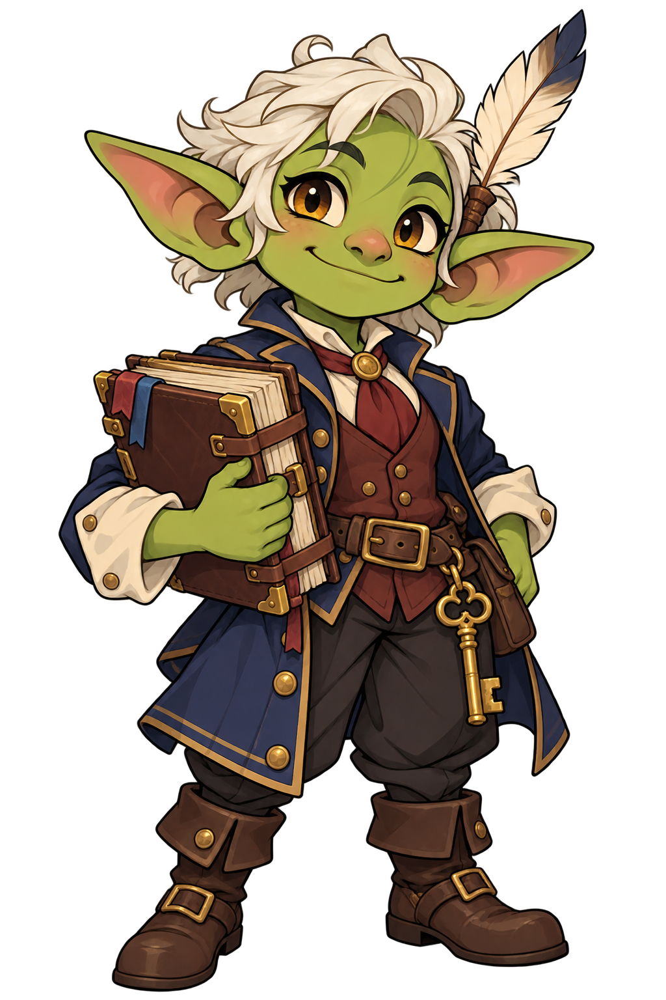

# Rackbops Clerk mascot assets

Rackbops Clerk is the fantasy town-clerk mascot for Docket and its tracker Discord instance. It does not replace Luma, the generic bot host mascot.

## Included

| File | Purpose | Status |
|---|---|---|
| [rackbops-clerk.png](rackbops-clerk.png) | Original approved concept, 1024x1536 RGBA | Canonical visual reference; atmospheric surround remains |
| [rackbops-clerk-design-spec.md](rackbops-clerk-design-spec.md) | Identity, construction, palette, poses, usage, regeneration prompt, and provenance | Design specification |

## Planned derivatives

The specification describes a clean transparent cutout, pose sheet, individual pose PNGs, square Discord avatar, and simplified favicon. These are not included in this initial package. Do not treat the reference image as a production cutout or shrink the full figure to favicon size.
